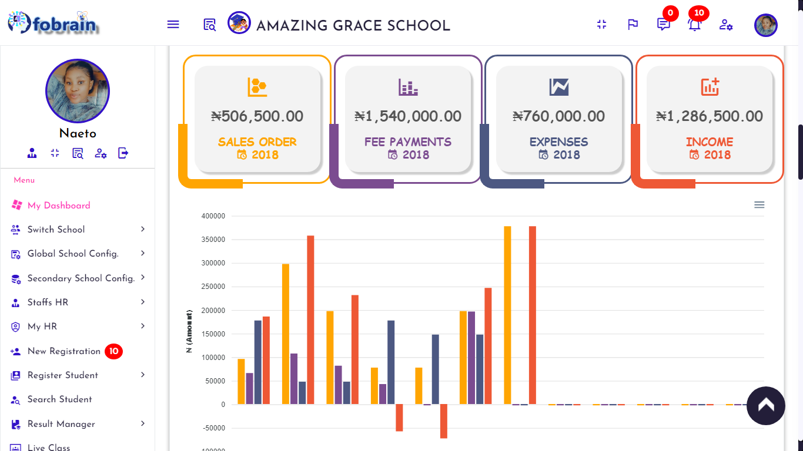
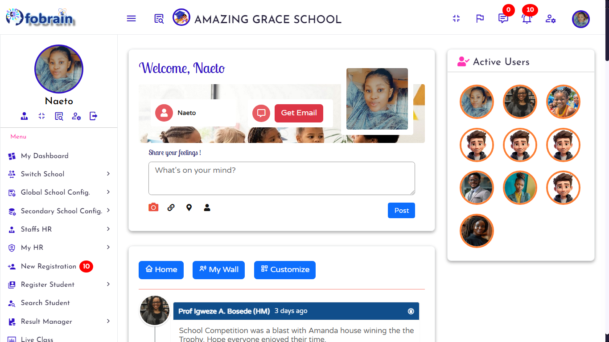
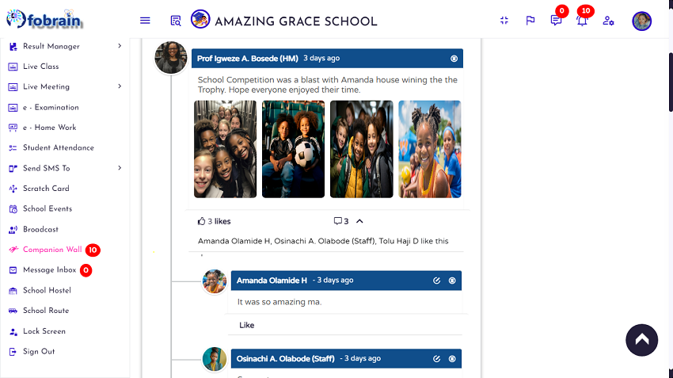
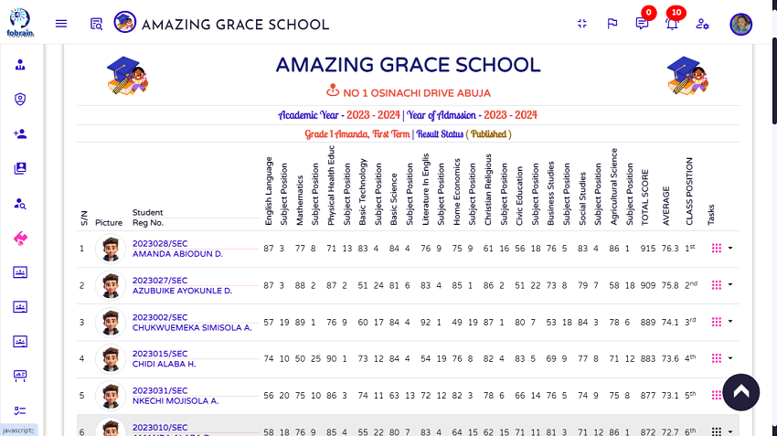
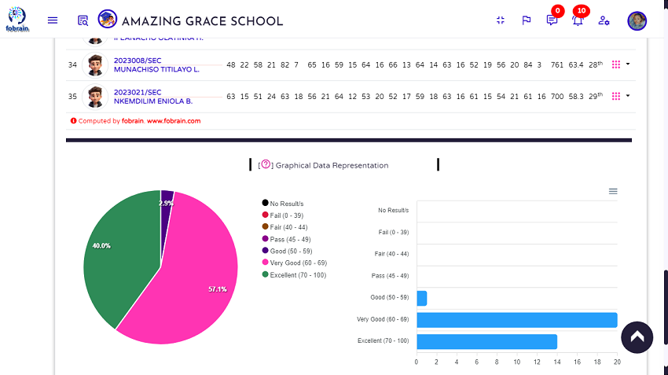
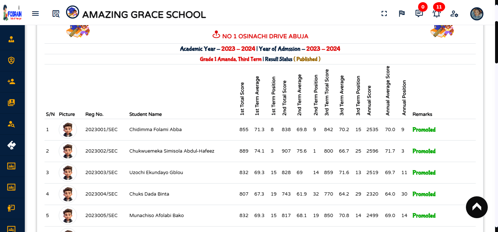
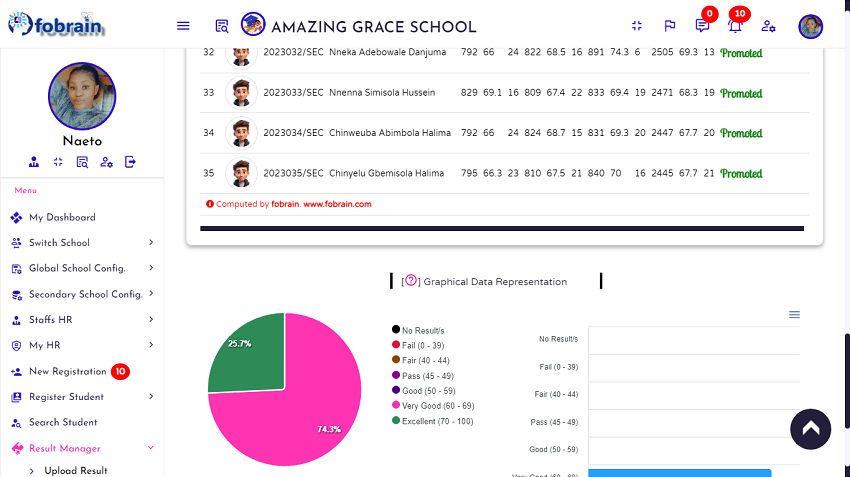
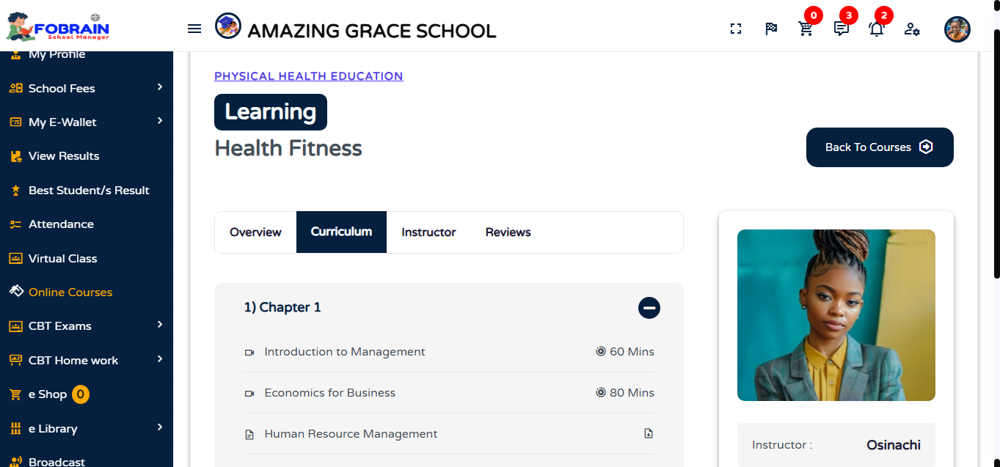
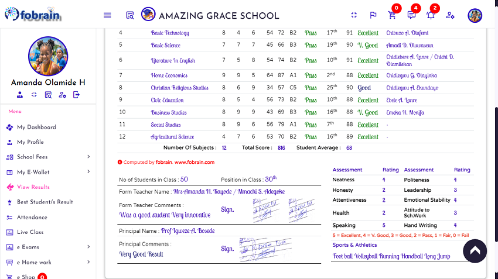
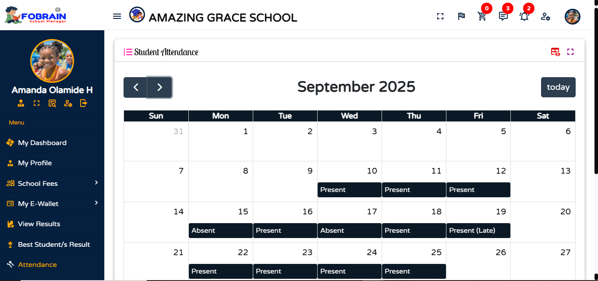

    

# foBrain AI School Manager 
Automate, monitor, run, manage, and engage with your students, parents, and staff effectively from any location.

 # About

   <b>foBrain AI</b> is an open source school management system that offers a comprehensive, robust, highly secure, and flexible AI-powered solution for managing K-12 schools (Nursery, Primary, and Secondary). foBrain has more than 100 unique and amazing features, along with 8 fabulous and unique dashboards that have different privileges assigned.

  

   <b>foBrain AI School Manager</b> has undergone numerous changes and enhancements over the past <b>16 years, evolving from Student Oracle, SDOSMS, and wizGrade to its current form as FoBrain AI</b>.

 # Our mission

	
    Our mission is to break down barriers in education by delivering a free, powerful, and community-driven school management solution. We aim to empower schools and institutions around the globe to unlock their full potential and create transformative learning experiences for every student.

 

 # Developer

	
    <b>foBrain AI</b> is designed and developed by <b>Igweze Ebele Mark</b> and is released under the <b>Apache License 2.0</b>

 

  

	<a href="https://www.docs.fobrain.com" target="_blank" rel="nofollow">Website</a>
	-
	<a href="https://www.docs.fobrain.com" target="_blank" rel="nofollow">Documentation</a>
	-
	<a href="https://www.demo.fobrain.com" target="_blank" rel="nofollow">Live Demo</a>

# Key Features

<ol> 
<li>Responsive (UI) web, mobile, tablet screen</li>
<li>Unlimited students, staffs and courses</li>
<li>Combined K12 (Nursery, Primary & Secondary) School module</li>
<li>8 Multi-Users Dashboard (School Admin/Receptionist, students, parents, staff, bursary, librarian, HM, class manager, etc dashboards)</li>
<li>Support more than 100+ language</li>
<li>Live Virtual Class & Meetings (Google Meet, Zoom, Microsoft Teams, and Video SDK)</li>
<li>Learning Management System (LMS)</li>
<li>Complete School Accounting Management</li>
<li>Graded CBT Exam & Homework (with Excel bulk Q & A uploads)</li>
<li>AI Auto. Transcript & Ranking</li>
<li>Daily Attendance & Comments, QR Attendance & Parents Reply</li>
<li>Complete School library module</li>
<li>Complete school e–shop (E-commerce) </li>
<li>Bulk Result & Registration Upload (Using Excel)</li>
<li>School Staffs and Students HR Manager</li>
<li>Staff Payroll & Leave</li>
<li>Management of course teacher results, online courses, live classes, and CBT, among others.</li>
<li>Student & Staff ID card generation (QR Code Embedded)</li>
<li>Automated computation of student's grades</li>
<li>Automated subjects and class ranking</li> 
<li>Automated class promotion module</li> 
<li>School bursary module</li>  
<li>Online student applications module</li>
<li>Computational result type module</li>
<li>Comment result type module</li>  
<li>Principal/Head Teacher automated comments</li>
<li>Class teacher auto suggest comments</li>
<li>Scratch Card Generation</li> 
<li>Parent's Multi-Child Selector</li>
<li>School population breakdown module</li>
<li>Broadcast SMS to student/parent/staff, etc. </li>
<li>Broadcast result to parent/guardian phone</li> 
<li>Robust school records and results search engine</li> 
<li>Graphical representation of student results & records</li>
<li>Best student module</li>
<li>Payment with ATM/Debit cards</li>  
<li>Class Assignment/Privileges Module</li>
<li>Customizable Payment and SMS Gateways</li> 
<li>School News module</li>
<li>School hostel module</li>
<li>School transportation module</li>
<li>School events manager</li>
<li>Exam time table  module</li>
<li>Automated lock screen  module</li>
<li>Student E-wallet</li>
<li>Customizable Student Grades</li>
<li>& many other Amazing Features . . . .</li>
</ol>  

# Some Screenshots  
## School bursary dashboard

 
 
## Live Virtual Class with  Video SDK

 

## Live Virtual Class with virtual classroom board

 

## School population breakdown

 

## Student Computation Result Mode

 

## Class Annual Result with Ranking & Promotion Status

 

## Graded CBT Exam

 

## Learning Management System (LMS)

 

## School e–shop (E-commerce)

 

## Daily Attendance & Comments with QR Code Scanning

  

# Installation & Documentation

> [!IMPORTANT]
> 
It requires PHP Version greater than <b>7</b> or below <b>8.3.11</b>

<ol>
<li>Clone the repository or download the project </li>
<li>Navigate to the project directory or unzip the files in your root domain/local host folder</li>
<li>Enter your project root address in the browser</li>
<li>It will automatically prompt you for installation</li>
<li> Exciting news! Get ready to dive into the installation process. Just a heads-up: you'll need to create your own database and enter it in the designated field. Let’s get started!</li>
<li>Once you’ve completed the installation, dive right in by logging in as the admin! You can personalize and tailor the foBrain School Manager to fit your needs. Let’s get started!</li>
</ol> 

For comprehensive, step-by-step instructions on installation and configuration, please visit - [https://www.docs.fobrain.com](https://www.docs.fobrain.com)

> [!NOTE]
> Installation process take <b>1 to 4 minutes</b> depending on your system and server configurations.

# Live Demo 
For a live demo, visit - https://www.demo.fobrain.com 

# Contributors 
We invite passionate contributors and partners to join us in the exciting journey of the foBrain AI project! Together, let's innovate and make a lasting impact!. To get started, fork the repository and submit a pull request.

# Donate & Support
We invite you to visit www.fobrain.com to learn about our project and consider supporting us. Your contributions are greatly appreciated.

# Website
https://www.fobrain.com
